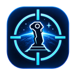
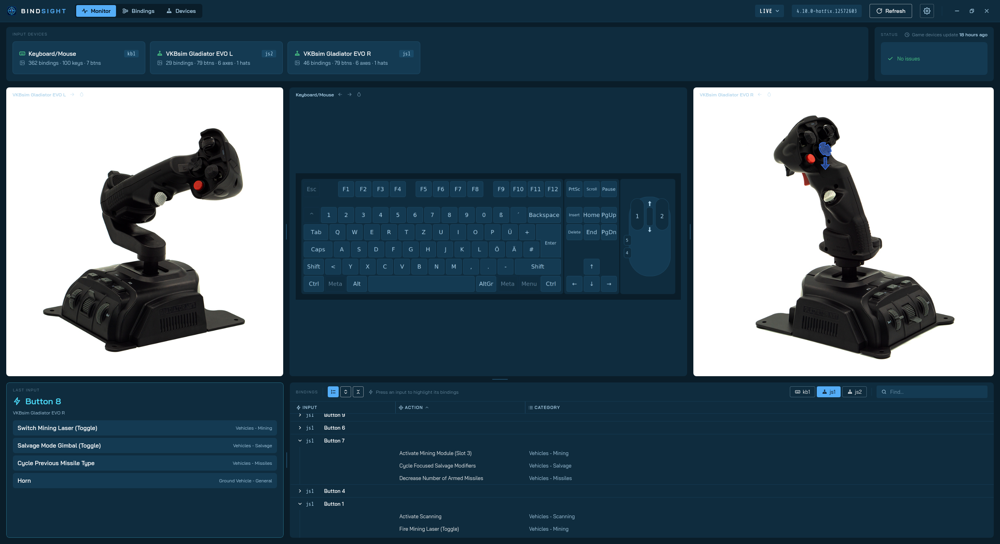
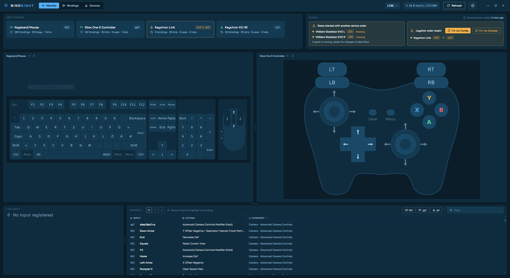
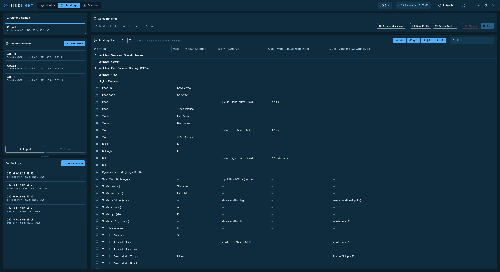
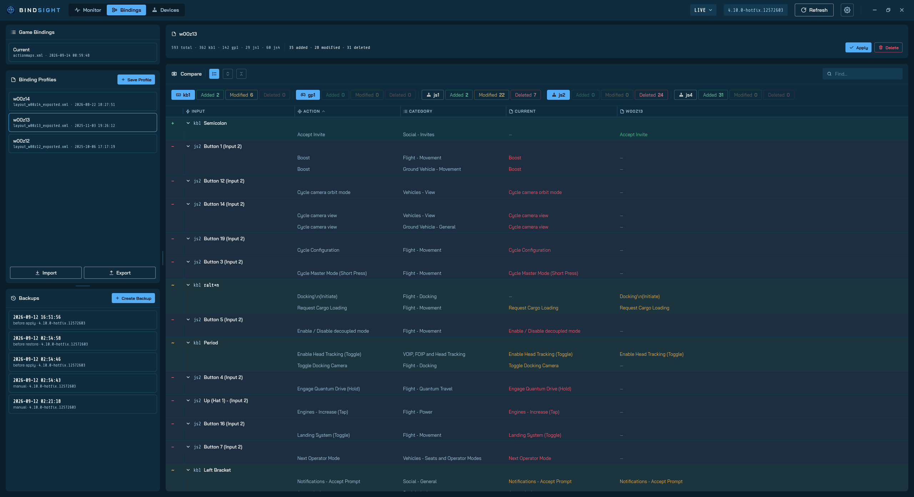
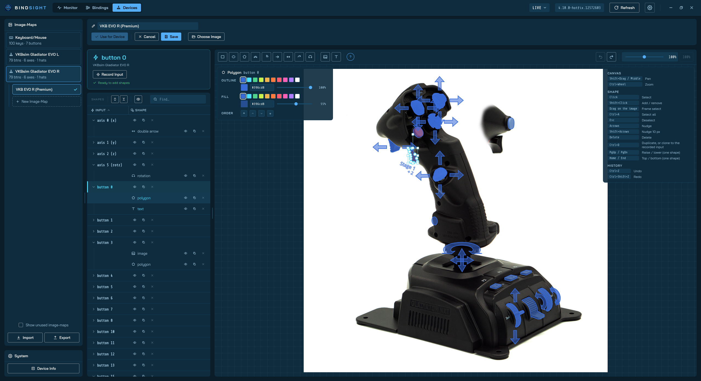

<p align="center">
  
</p>

<h1 align="center">BindSight</h1>
<p align="center">
  Star Citizen input binding VISUALIZER and MAPPER.
</p>
<h4 align="center"><em>"BindSight gets your binds right!"</em></h4>

<p align="center">
  
  
  <a href="LICENSE"></a>
</p>

<!-- screenshot: Monitor mode with a joystick image-map lit -->

The intention of this app is to be an add-on utility for the game [Star Citizen](https://robertsspaceindustries.com/en/) with the goal to provide usable and powerful management features for input devices like **keyboard/mouse, joysticks and gamepads**, which the game is currently lacking.

You always forget what input which action was? You always get lost in the game's huge and impractical bindings list? You have issues with the game breaking your device bindings? Then this app is for you!

## Main Features

### 👀 Input Monitor

Answers the question: *"What does each button do, and where does each action live?"*

- **Press any input, see the bound actions!** The app displays configured game bindings for keys, buttons, axes etc. for any input device in realtime.
- **Select an action, see the bound input!** An "images and shapes"-based visualization of the input device shows you the keys, buttons, axes etc. which are bound to a specific action via realtime highlighting.

<p align="center">
  <a href="docs/img/preview_app_monitor1.png"></a>
  &nbsp;
  <a href="docs/img/preview_app_monitor2.png"></a>
</p>

### 🕹️ Action Bindings

Extended version of the game's **bindings interface**:

- **Search, filter and sort** functionality and support for **re-binding** inputs.

- **Import and export of binding profiles** per device with a detailed **compare interface** for a clear insight into differences to configured bindings.

<p align="center">
  <a href="docs/img/preview_app_bindings1.png"></a>
  &nbsp;
  <a href="docs/img/preview_app_bindings2.png"></a>
</p>

</p>

### 🖼️ Custom Visualizations

Due to the built-in **visualization editor** the app supports a near infinite amount of devices!

- Build your own visualizations for your devices with images, shapes, text and colors. You can even share them via im- and export ;)

- *Currently included are following device visualizations:*
  
  - Generic Keyboard/Mouse (US/DE + TKL)
  
  - Generic Xbox and PlayStation Controller
  
  - VKB Gladiator NXT EVO R (Premium)
  
  - VKB Gladiator NXT EVO Omni L (Premium)

<p align="center">
  <a href="docs/img/preview_app_devices1.png"></a>
</p>

### 🖥️ Cross-Platform

The app supports **Windows** and **Linux**! 

- *Currently tested with Windows 10 and Nobara Linux 44.*

- If you haven't already, try Linux now :)

## Additional Tools

### 🔀 Device Order Fix

- Currently Star Citizen does not assign your device bindings in a reliable way, so bindings can get broken when devices are un/plugged on game startup.
- The app can recognize and fix those issues beforehand or while in-game!

### 💾 Backups

- By default, the app makes backups of every changed game file before any modification. You can always revert unintentional or faulty changes!
- And of course, you can manually back up at any time.

### 🔍 Device Info

- Every fact about your devices plus a live event log, savable for troubleshooting.

## Infos

### ⚙️ Settings

#### Game Environments

1. Choose the correct Star Citizen game folders (the ones with a `Data.p4k` file in them) for your existing environments like LIVE and PTU, e.g.:
   - *Windows:* `C:\Program Files\Roberts Space Industries\StarCitizen\LIVE` 
   - *Linux/Wine:* `<wine-prefix>/drive_c/Program Files/Roberts Space Industries/StarCitizen/LIVE`
2. You can then switch the used Star Citizen environment on-the-fly in the app.

### 💡FAQ / Known Issues

- ESC key is never captured or recorded due to technical reasons (doesn't have a configurable binding either).
- Mouse inputs are only captured while recording inputs (you need the mouse to use the app anyway).
- Gamepad triggers are only buttons, no axis, as currently in the game.
- A running game keeps its configuration and device order. You have to restart the game for most changes to take effect.
- The app only shows connected devices which are also seen by the game (this specifically applies to Linux/Wine).
- *POTENTIAL ISSUE:* app is untested with multiple devices of same type (e.g. two times the same joystick) and duplicate device-IDs might cause problems.

### 🗓️ Planned Features

- Support for managing input inversion-, sensitivity- and deadzone settings.

- Improved responsiveness so the GUI works better with smaller window sizes.

## Building

1. Fetch the [StarBreaker](https://github.com/diogotr7/StarBreaker) sidecar:
   
   ```sh
   scripts/fetch-starbreaker.sh      # Linux, Git Bash
   scripts\fetch-starbreaker.ps1     # PowerShell
   ```

2. Install toolchain and dependencies:
   
   - **All platforms**: `rustup`, `pnpm`
   - **Linux (Fedora/Nobara)**: `webkit2gtk4.1-devel openssl-devel libappindicator-gtk3-devel librsvg2-devel libxdo-devel SDL2-devel`, group `c-development`
   - **Windows**: Visual Studio Build Tools 2022+ with the workload *Desktop development with C++*, CMake on `PATH` (SDL2 is built from source and linked statically)

3. Build and run the app:
   
   ```sh
   pnpm install
   pnpm tauri dev                     # development
   pnpm tauri build                   # release bundle
   cd src-tauri && cargo test --lib   # backend tests, no hardware needed
   ```

## Under the Hood

| Part           | What                                                                                                                                                      |
| -------------- | --------------------------------------------------------------------------------------------------------------------------------------------------------- |
| Shell          | [Tauri 2](https://tauri.app), Rust                                                                                                                        |
| Frontend       | Vue 3, TypeScript, Vite, [Konva](https://konvajs.org) (editor)                                                                                            |
| Input          | [SDL2](https://libsdl.org) joystick + GameController APIs, [hidapi](https://github.com/libusb/hidapi) (HID names, axis usages), webview (keyboard, mouse) |
| Joystick order | DirectInput 8 `EnumDevices` via `windows-sys`; on Linux Wine's registry key order rebuilt from hidapi + sysfs                                             |
| Game data      | [StarBreaker](https://github.com/diogotr7/StarBreaker) extracts `defaultProfile.xml`, `global.ini`, token labels from `Data.p4k`                          |
| XML            | `quick-xml` parsing; textual rewrites keep the game's file layout; atomic writes, re-parsed before applied                                                |

## Credits

- [StarBreaker](https://github.com/diogotr7/StarBreaker) by diogotr7, used for extracting Star Citizen game data
- [Wine](https://www.winehq.org) source, for the DirectInput and winebus behaviour replicated on Linux
- [Star Citizen](https://robertsspaceindustries.com/en/) and its data belong to [Cloud Imperium Games](https://cloudimperiumgames.com). 
  *This app does not include game assets or resources.*
